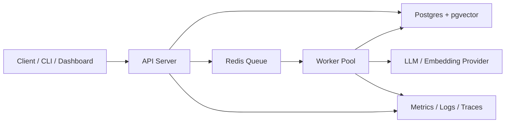

# AI 任務執行平台設計規格

## 目標

這個 side project 的目標是證明 Sr SWE 等級的後端與 AI 平台能力，而不是只做一個聊天機器人 demo。專案主軸是一個可執行長時間 AI workload 的任務平台，第一個 workload 是文件 ingestion 與 RAG 索引建立。

面試敘事：

> 我做了一個用來執行長時間 AI 任務的 backend platform。設計重點不是 demo，而是可靠執行、可重試、可觀測、可控成本，並且支援 RAG ingestion 作為其中一種 workload。

## 成功標準

- 能展示清楚的系統設計：API、資料庫、queue、worker、狀態機、觀測性。
- 能展示可靠性處理：idempotency、retry、dead letter queue、失敗恢復。
- 能展示 AI 工程能力：文件切片、embedding、向量檢索、token 成本追蹤、模型抽象。
- 能展示可維運性：metrics、structured logs、trace id、任務延遲與錯誤率。
- README 能讓面試官在 5 分鐘內理解架構與 trade-off。

## MVP 範圍

### 核心功能

1. 建立 AI job
   - Client 透過 API 建立任務。
   - 任務包含 type、payload、idempotency key、priority。
   - MVP 支援 `document_ingestion` 一種任務型別。

2. 任務狀態機
   - `queued`
   - `running`
   - `retrying`
   - `failed`
   - `completed`
   - `dead_lettered`

3. Worker 執行流程
   - 從 queue 取出 job。
   - 鎖定 job 避免重複執行。
   - 執行 step。
   - 寫入 step result。
   - 成功後推進狀態。
   - 失敗後依錯誤類型決定 retry 或 dead letter。

4. RAG ingestion workload
   - 上傳或指定文件文字內容。
   - 將文件切成 chunks。
   - 建立 embedding。
   - 寫入 Postgres + pgvector。
   - 記錄 embedding model、chunk strategy、token 使用量。

5. 查詢 API
   - 根據 query 建立 embedding。
   - 使用 pgvector 找相似 chunk。
   - 回傳來源 chunk、score、document id。
   - MVP 不需要完整聊天 UI，重點放在 retrieval pipeline。

6. 觀測性
   - 每個 job 有 trace id。
   - 每個 step 記錄 latency、status、error。
   - 提供 metrics endpoint 或簡化 dashboard。
   - 指標包含 job 成功率、失敗率、retry 次數、平均延遲、token 成本。

### 非目標

- 不做大型前端 SaaS。
- 不做多租戶 billing。
- 不做複雜 agent planner。
- 不追求支援所有 LLM provider，MVP 只需要一個 provider abstraction 介面。

## 建議技術棧

### 首選

- Backend：FastAPI
- Worker：Celery
- Queue / Broker：Redis
- Database：Postgres + pgvector
- Observability：OpenTelemetry + structured logging
- Local dev：Docker Compose
- Tests：pytest

理由：FastAPI + Celery + Postgres 能快速展示後端平台能力，學習與實作成本合理，也容易在 README 中清楚說明架構。

### 替代方案

- NestJS + BullMQ + Redis + Postgres
- Go + asynq + Redis + Postgres

若面試目標偏 Node.js 全端或台灣新創常見 stack，可選 NestJS。若想強調系統程式與高效能後端，可選 Go。

## 架構



## 主要資料表

### jobs

- `id`
- `type`
- `status`
- `payload`
- `idempotency_key`
- `priority`
- `attempt_count`
- `max_attempts`
- `next_run_at`
- `trace_id`
- `created_at`
- `updated_at`

### job_steps

- `id`
- `job_id`
- `name`
- `status`
- `input`
- `output`
- `error_code`
- `error_message`
- `started_at`
- `finished_at`

### documents

- `id`
- `source_name`
- `content_hash`
- `metadata`
- `created_at`

### document_chunks

- `id`
- `document_id`
- `chunk_index`
- `content`
- `embedding`
- `embedding_model`
- `token_count`
- `metadata`

### llm_usage

- `id`
- `job_id`
- `provider`
- `model`
- `operation`
- `input_tokens`
- `output_tokens`
- `estimated_cost`
- `created_at`

## API 草案

### 建立任務

`POST /jobs`

```json
{
  "type": "document_ingestion",
  "idempotencyKey": "document:abc123:v1",
  "payload": {
    "sourceName": "example.md",
    "content": "..."
  }
}
```

### 查詢任務

`GET /jobs/{jobId}`

回傳任務狀態、step 狀態、錯誤、token 成本。

### 查詢相似內容

`POST /retrieval/query`

```json
{
  "query": "這份文件的主要風險是什麼？",
  "topK": 5
}
```

## 錯誤處理

- 暫時性錯誤：LLM provider timeout、rate limit、Redis transient error，使用 exponential backoff retry。
- 永久性錯誤：payload schema invalid、文件格式不支援，直接 failed。
- 超過 retry 上限：進入 dead letter queue，保留錯誤與最後一次 input。
- 重複請求：透過 `idempotency_key` 回傳既有 job，而不是建立新 job。

## 測試策略

- Unit tests
  - job 狀態機轉移。
  - retry/backoff 計算。
  - idempotency 行為。
  - chunking strategy。

- Integration tests
  - 建立 job 後 worker 能完成 ingestion。
  - provider timeout 時會 retry。
  - 超過 retry 上限會進 dead letter。
  - retrieval query 能回傳預期 chunk。

- Load test
  - 建立 1,000 筆 ingestion job。
  - 記錄吞吐量、p95 latency、失敗率、Redis queue depth。

## README 展示重點

README 應該用繁體中文撰寫，包含：

- 這個專案解決什麼問題。
- 架構圖。
- 本機啟動方式。
- API 範例。
- 狀態機圖。
- failure modes 與設計取捨。
- 壓測結果。
- 面試可講的 senior signals。

## 里程碑

1. 建立 API、DB schema、Docker Compose。
2. 實作 job 狀態機與 idempotency。
3. 實作 queue 與 worker。
4. 實作 document ingestion workload。
5. 加入 retrieval API。
6. 加入 metrics、logs、trace id。
7. 補齊測試與壓測腳本。
8. 完成 README、架構圖與面試講稿。

